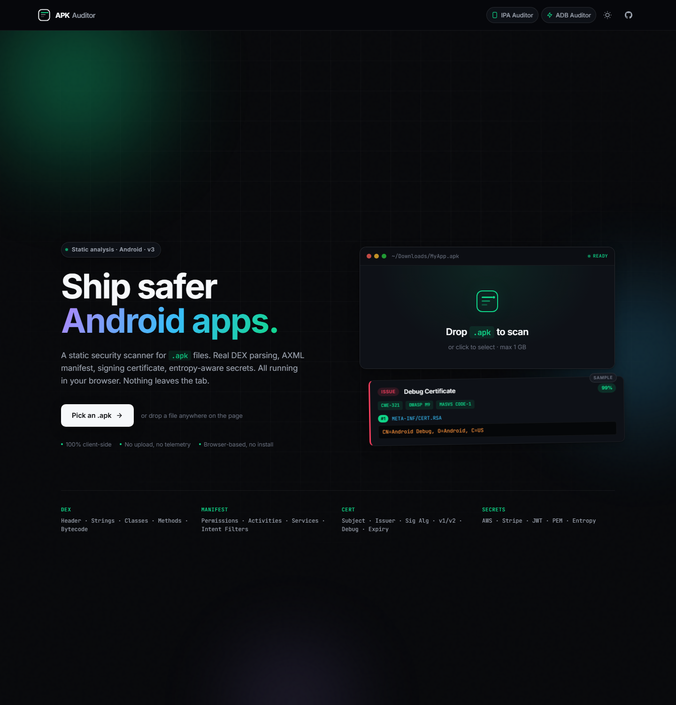
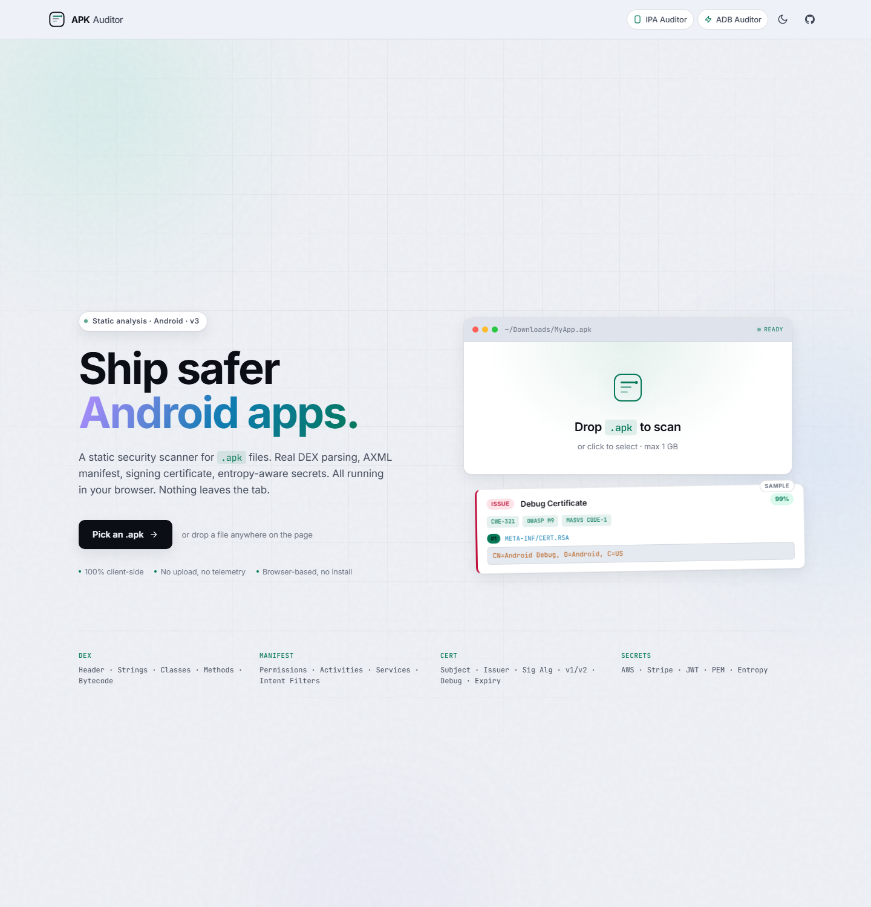

# APK Auditor

[](LICENSE)
[](../../releases)
[](https://developer.mozilla.org/en-US/docs/Web/JavaScript)

Drop an APK on the page. The browser parses the DEX bytecode, decodes the binary AndroidManifest, reads the signing certificate, walks the components, hunts for secrets, and shows you a security score. Nothing leaves the tab.

Try it: [apkauditor.com](https://apkauditor.com)



## What it actually does

It runs everything client-side. The APK ZIP is read with JSZip, then:

- **DEX parsing** reads the header, string pool, type IDs, method IDs, class defs, and bytecode. Up to 10 DEX files are supported (classes.dex through classes10.dex).
- **AXML parser** decodes the binary AndroidManifest into XML so you can read it.
- **PKCS#7 parser** walks the signing certificate DER tree to extract subject, issuer, algorithm, validity, and fingerprint.
- **APK Signing Block scan** looks for the v2/v3 magic in the trailing bytes.
- **Resource decoder** reads compiled `resources.arsc` enough to flag hardcoded secrets in string resources.
- **Tracker detection** matches DEX strings against known SDK fingerprints (Firebase, AdMob, Crashlytics, Branch, and 30+ others).
- **Rule engine** applies 80+ static rules covering crypto, network, manifest, WebView, storage, and code patterns. Each finding is tagged with CWE, OWASP Mobile Top 10, and MASVS.
- **Entropy-aware secret detection** runs Shannon entropy over candidate strings to suppress noisy false positives. Vendor regexes for AWS, Stripe, GitHub, Slack, Google API keys, JWT, PEM blocks, Twilio, and more.

## Architecture (v3)

The 3300-line monolith is gone. Code is split into focused modules:

```
src/
  main.js              UI coordinator, tabs, rendering, drag and drop
  analyzer.worker.js   Web Worker entry point, isolates the analysis off the main thread
  styles.css           Theme, layout, components
  core/
    engine.js          AXML, DEX, PKCS#7, rule engine, tracker matching, scoring
    entropy.js         Shannon entropy and vendor secret patterns
    export.js          JSON / CSV / SARIF 2.1 export
    pdf.js             Printable PDF audit report
lib/
  jszip.min.js
  jspdf.umd.min.js
```

Analysis runs in a Web Worker, so the UI stays responsive while a large APK is being parsed. If the worker fails to spawn, the page transparently falls back to running on the main thread.

## Tabs

Six tabs cover the analysis:

- **Overview** - security score, app metadata, dangerous permissions, tracker SDKs
- **Findings** - all rule hits with severity filter, search, confidence slider, sort, expand-all, copy-match. Filter by severity (Issues / Info / Secure), confidence threshold, free-text search across rule name / file / match / CWE, and sort by severity, confidence, count, or name. Press `/` to focus search. Each instance has a copy-to-clipboard button.
- **Manifest** - parsed package info, permission table, raw decoded AndroidManifest.xml
- **Components** - activities, services, receivers, providers with exported flag and intent filters. Marks exported components in red and shows the intent filters that make them reachable from other apps. Implicit `exported=true` (when an intent filter is present but the attribute is omitted) is detected too.
- **Cert** - signing certificate subject, issuer, algorithm, validity, fingerprint, v1/v2 status. Flags debug certificates, expired certificates, and weak signature algorithms (MD5withRSA, SHA1withRSA). Tells you whether the APK has a v2/v3 signing block - APKs that ship only v1 are vulnerable to the Janus exploit on Android < 7.
- **Explorer** - file tree with viewer, hex dump for binaries, syntax-aware view for text. Opens AndroidManifest.xml, resources.arsc, any file inside `lib/`, `res/`, `assets/`, or `META-INF/`. Images render inline. Binaries get a paginated hex viewer. The Download button saves the current file to disk.

## Run it locally

Open `index.html` in a modern browser, or serve the directory:

```bash
python -m http.server 8765
# open http://localhost:8765/
```

There is no build step. No npm install. No service worker. It is plain JavaScript.

## Export

The Export menu emits four formats:

- **PDF** - printable audit with cover page, summary, findings (every instance), certificate, components, and trackers
- **JSON** - the full result tree
- **CSV** - flat findings table for spreadsheets
- **SARIF 2.1** - drop into GitHub Code Scanning

## Keyboard

| Key                | Action                          |
|--------------------|---------------------------------|
| `Alt + 1..6`       | Jump to tab                     |
| `/`                | Focus findings search           |
| `Esc`              | Collapse findings / close menus |
| `Arrow keys`       | Move between tabs               |

## Theme

Toggle button in the header cycles dark ↔ light. The choice is stored in localStorage. You can also force one with `?theme=dark` or `?theme=light` in the URL.



## Privacy

The APK is read into an ArrayBuffer with the File API, transferred to the Web Worker, parsed in memory, and discarded when you close the tab. There is no network call. The page has a strict CSP that disallows it. You can run it offline.

## Coverage

| Area      | Checks                                                                                              |
|-----------|-----------------------------------------------------------------------------------------------------|
| Manifest  | Debug flag, allowBackup, missing NSC, exported components, custom permissions, deep links           |
| Crypto    | MD5 / SHA-1 / DES / RC4, ECB mode, static IVs, hardcoded keys                                       |
| Network   | Cleartext HTTP, missing pinning, custom TrustManagers, hostname verifier bypass                     |
| WebView   | JavaScript enabled, file access, addJavascriptInterface, mixed content                              |
| Storage   | MODE_WORLD_READABLE / WRITABLE, external storage, SQLite raw queries, hardcoded SharedPrefs         |
| Code      | Reflection, dynamic class loading, runtime exec, clipboard, screenshot blocking                     |
| Secrets   | AWS / Stripe / Google / Firebase / GitHub / Slack / Twilio / JWT / PEM with entropy gating          |
| Signing   | v1-only, debug cert, expired cert, weak signature algorithm                                         |

## Limits

- Each rule emits at most 20 instances per file, capped at 500 per rule globally
- Up to 5000 DEX classes are scanned for rule patterns (the parser still reads them all)
- Resource files larger than 300 KB are sampled rather than scanned end-to-end
- Hex viewer pages at 4 KB increments to keep large binaries responsive

## License

CC BY-NC-ND 4.0. See [LICENSE](LICENSE).

## Author

Built by [Sandeep Wawdane](https://github.com/thecybersandeep).

For authorized testing and educational use. Get permission before analyzing APKs you do not own.

## Sister tools

- [IPA Auditor](https://ipaauditor.com) - drag-drop iOS IPA static analyzer
- [ADB Auditor](https://adbauditor.com) - live Android audit over WebUSB and ADB
